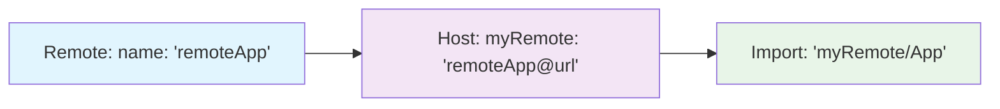

# 2.6 Exposing & Consuming Components in Micro-Frontends

> **What you'll learn**: How to share React components between independent micro-frontend applications using Webpack Module Federation

## 🎯 Quick Start: 3-Step Setup

### Step 1: Remote App Exposes Components

```js
// remote/webpack.config.js
const ModuleFederationPlugin = require('@module-federation/webpack');

new ModuleFederationPlugin({
  name: 'remoteApp', // Remote's unique identifier
  filename: 'remoteEntry.js', // Entry point file
  exposes: {
    './App': './src/App.tsx', // Public API: './App' → Internal: './src/App.tsx'
  },
  shared: {
    react: { singleton: true },
    'react-dom': { singleton: true },
  },
});
```

### Step 2: Host App Configures Remote

```js
// host/webpack.config.js
new ModuleFederationPlugin({
  name: 'host',
  remotes: {
    myRemote: 'remoteApp@http://localhost:3001/remoteEntry.js',
    //  ↑         ↑
    //  alias     remote name (must match Step 1)
  },
  shared: {
    react: { singleton: true },
    'react-dom': { singleton: true },
  },
});
```

### Step 3: Host App Imports Component

```tsx
// host/src/App.tsx
import { Suspense, lazy } from 'react';

const RemoteApp = lazy(() => import('myRemote/App'));
//                                      ↑      ↑
//                                    alias  expose key

const App = () => (
  <div>
    <h1>Host Application</h1>
    <Suspense fallback={<div>Loading remote...</div>}>
      <RemoteApp />
    </Suspense>
  </div>
);
```

✅ **Verify it works**:

```bash
# 1. Visit http://localhost:3000
# 2. You should see TWO bordered sections:
#    - Green border: "Host Application" (port 3000)
#    - Blue border: "Remote App Component" (port 3001)
# 3. Check browser Network tab - you'll see remoteEntry.js loaded
# 4. Validate: curl http://localhost:3001/remoteEntry.js returns JavaScript
```


---

## 🔗 The Critical Connection: Name → Alias → Import

The **most common Module Federation mistake** is misunderstanding this relationship:



| Remote Config       | Host Config                 | Import Statement          | ✅/❌                  |
| ------------------- | --------------------------- | ------------------------- | ---------------------- |
| `name: 'remoteApp'` | `myRemote: 'remoteApp@...'` | `import('myRemote/App')`  | ✅ Perfect             |
| `name: 'remoteApp'` | `myRemote: 'wrongName@...'` | `import('myRemote/App')`  | ❌ Name mismatch       |
| `name: 'remoteApp'` | `myRemote: 'remoteApp@...'` | `import('remoteApp/App')` | ❌ Use alias, not name |

---

## 📋 Complete Working Example

### Remote Application (`remote/`)

**webpack.config.js**

```js
const ModuleFederationPlugin = require('@module-federation/webpack');

module.exports = {
  mode: 'development',
  devServer: { port: 3001 },
  plugins: [
    new ModuleFederationPlugin({
      name: 'remoteApp',
      filename: 'remoteEntry.js',
      exposes: {
        './App': './src/App.tsx',
        './Button': './src/components/Button.tsx',
      },
      shared: {
        react: { singleton: true, requiredVersion: '^18.0.0' },
        'react-dom': { singleton: true, requiredVersion: '^18.0.0' },
      },
    }),
  ],
};
```

**src/App.tsx**

```tsx
import React from 'react';

const App: React.FC = () => (
  <div style={{ border: '2px solid blue', padding: '20px', margin: '10px' }}>
    <h2>🚀 Remote App Component</h2>
    <p>This component is loaded dynamically from port 3001</p>
  </div>
);

export default App;
```

### Host Application (`host/`)

**webpack.config.js**

```js
const ModuleFederationPlugin = require('@module-federation/webpack');

module.exports = {
  mode: 'development',
  devServer: { port: 3000 },
  plugins: [
    new ModuleFederationPlugin({
      name: 'host',
      remotes: {
        remote: 'remoteApp@http://localhost:3001/remoteEntry.js',
      },
      shared: {
        react: { singleton: true, requiredVersion: '^18.0.0' },
        'react-dom': { singleton: true, requiredVersion: '^18.0.0' },
      },
    }),
  ],
};
```

**src/App.tsx**

```tsx
import React, { Suspense, lazy } from 'react';

const RemoteApp = lazy(() => import('remote/App'));

const App: React.FC = () => (
  <div>
    <div style={{ border: '2px solid green', padding: '20px', margin: '10px' }}>
      <h1>🏠 Host Application</h1>
      <p>This is the main application running on port 3000</p>
    </div>

    <Suspense fallback={<div>Loading remote component...</div>}>
      <RemoteApp />
    </Suspense>
  </div>
);

export default App;
```

**🚀 Run Commands:**

```bash
# Terminal 1: Start remote
cd remote && yarn install && yarn dev
# ✅ Success: "webpack compiled successfully" + port 3001

# Terminal 2: Start host
cd host && yarn install && yarn dev
# ✅ Success: "webpack compiled successfully" + port 3000

# Terminal 3: Test connectivity
curl -f http://localhost:3001/remoteEntry.js | head -5
# ✅ Success: Should show JavaScript code, not 404

# Visit: http://localhost:3000
```

**🧪 Test Your Setup:**

```bash
# Verify both apps are independent
curl http://localhost:3000  # Host app HTML
curl http://localhost:3001  # Remote app HTML

# Check module federation entry
curl http://localhost:3001/remoteEntry.js | grep -o "remoteApp" | head -1
# Should output: remoteApp
```

---

## ⚠️ Troubleshooting Guide

### Problem: "Module not found: Can't resolve 'remote/App'"

**Diagnosis Checklist:**

```bash
# 1. Check if remote is running
curl http://localhost:3001/remoteEntry.js
# Should return JavaScript, not 404

# 2. Verify name matching
# Remote: name: 'remoteApp'
# Host: 'remoteApp@http://localhost:3001/remoteEntry.js'
#           ↑ Must match exactly

# 3. Check import syntax
# import('aliasName/exposeKey')
# NOT import('remoteName/exposeKey')
```

### Problem: "Shared module is not available for eager consumption"

**Solution:**

```js
// Add to webpack.config.js entry
entry: './src/bootstrap.tsx',
  // Create src/bootstrap.tsx
  import('./App');

// Original src/index.tsx becomes bootstrap
```

### Problem: "Invalid hook call" or React context issues

**Cause**: Multiple React instances running
**Solution**: Ensure singleton configuration:

```js
shared: {
  react: {
    singleton: true,           // ✅ Only one React instance
    requiredVersion: '^18.0.0' // ✅ Version enforcement
  },
}
```

---

## 📚 Advanced Patterns

### Multiple Component Exposure

```js
// remote/webpack.config.js
exposes: {
  './App': './src/App.tsx',
  './components/Button': './src/components/Button.tsx',
  './components/Modal': './src/components/Modal.tsx',
  './utils/api': './src/utils/api.ts',
  './hooks/useAuth': './src/hooks/useAuth.ts',
}
```

### Type-Safe Imports

```ts
// host/src/types/remotes.d.ts
declare module 'remote/App' {
  const App: React.ComponentType;
  export default App;
}

declare module 'remote/components/Button' {
  interface ButtonProps {
    label: string;
    onClick: () => void;
  }
  const Button: React.ComponentType<ButtonProps>;
  export default Button;
}
```

### Error Boundary Pattern

```tsx
// host/src/components/RemoteWrapper.tsx
import React, { Suspense } from 'react';

interface Props {
  children: React.ReactNode;
  fallback?: React.ReactNode;
}

class RemoteErrorBoundary extends React.Component<Props> {
  state = { hasError: false };

  static getDerivedStateFromError() {
    return { hasError: true };
  }

  render() {
    if (this.state.hasError) {
      return this.props.fallback || <div>Remote component failed to load</div>;
    }
    return this.props.children;
  }
}

export const RemoteWrapper: React.FC<Props> = ({ children, fallback }) => (
  <RemoteErrorBoundary fallback={fallback}>
    <Suspense fallback={<div>Loading...</div>}>{children}</Suspense>
  </RemoteErrorBoundary>
);
```

---

## ✅ Best Practices Checklist

- [ ] **Naming**: Use descriptive, stable expose keys (`./components/Header` not `./Header`)
- [ ] **Versioning**: Pin shared dependency versions (`requiredVersion: '^18.0.0'`)
- [ ] **Error Handling**: Wrap remotes in error boundaries and suspense
- [ ] **TypeScript**: Create type declarations for remote modules
- [ ] **Documentation**: Document exposed components' props and usage
- [ ] **Testing**: Test both host and remote independently
- [ ] **Monitoring**: Log remote loading failures in production

---

## 🔍 Key Concepts Summary

| Concept          | Definition                             | Example                                                       |
| ---------------- | -------------------------------------- | ------------------------------------------------------------- |
| **Remote**       | App that exposes components            | `name: 'remoteApp'`, `exposes: { './App': './src/App' }`      |
| **Host**         | App that consumes remote components    | `remotes: { alias: 'remoteName@url' }`                        |
| **Expose Key**   | Public API name for component          | `'./App'` becomes importable as `'alias/App'`                 |
| **Remote Alias** | Local name for remote in host          | `myRemote: 'remoteApp@url'` → use `'myRemote'` in imports     |
| **Singleton**    | Shared dependency with single instance | `react: { singleton: true }` prevents multiple React versions |

---

## 📖 Learning Path & Next Steps

### ✅ **Mastery Checklist - You Can Now:**

- [ ] Set up Module Federation in 3 steps
- [ ] Understand name → alias → import relationship
- [ ] Debug common "Module not found" errors
- [ ] Configure singleton shared dependencies
- [ ] Handle loading states with Suspense
- [ ] Implement error boundaries for remotes

### 🔜 **Next Topic**: [2.7 React.lazy + Suspense with Remote Modules](./2.7-react-lazy-suspense.md)

**What you'll learn**: Advanced loading patterns, code splitting strategies, performance optimization

### 🔮 **Your Learning Journey**:

```
Basic Setup (You are here!) → Advanced Loading → Error Handling → Production Deploy
```

---

## 🚀 Quick Reference Card

### Essential Commands

```bash
# Setup (one time)
yarn install                 # Install dependencies

# Development
yarn dev                     # Start development server
curl http://localhost:PORT/remoteEntry.js  # Test remote

# Debug
import('remoteName/moduleName')  # Import pattern
// Check: name matches, alias correct, expose key exists
```

### Configuration Template

```js
// Remote template
new ModuleFederationPlugin({
  name: 'UNIQUE_NAME', // ← Use in host's remotes
  filename: 'remoteEntry.js',
  exposes: { './MODULE': './src/FILE' }, // ← Use in import
  shared: { react: { singleton: true } },
});

// Host template
new ModuleFederationPlugin({
  name: 'host',
  remotes: { ALIAS: 'UNIQUE_NAME@URL' }, // ← Use ALIAS in import
  shared: { react: { singleton: true } },
});
```

### Import Pattern

```js
const Component = lazy(() => import('ALIAS/MODULE'));
//                                     ↑     ↑
//                                     |  expose key
//                                remote alias
```

---

## 📚 References

- [Webpack Module Federation](https://webpack.js.org/concepts/module-federation/)
- [Module Federation Examples](https://github.com/module-federation/module-federation-examples)
- [Micro-Frontend Architecture](https://micro-frontends.org/)
